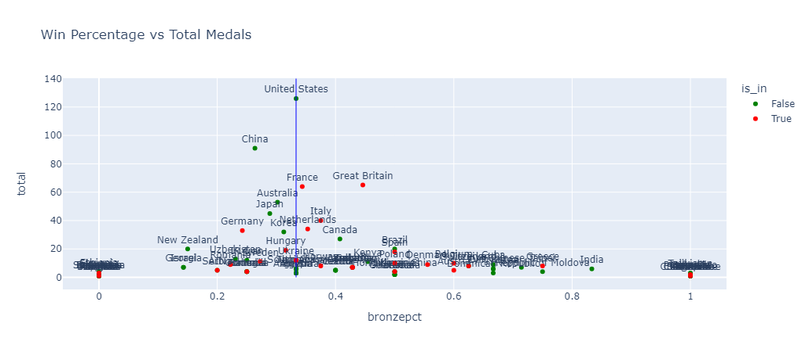

# Olympic-mystery
Exploring the olympic phenomenon that European countries win disproportionately many bronze medals.

Source: [I Have Uncovered an Olympics Mystery... (youtube.com)](https://www.youtube.com/watch?v=kuvKukJNmzI)

All else equal, each Olympic medal (Gold, Silver, Bronze) is equally likely to be won because the same number is (generally, but not always) given out.

However, in practice we see that bronze is ~3% more likely to be won than any other for any (random) country. 
With that said, in Europe, reliably over the years, this relative chance baloons to +7%. Why?

Using data provided by [Kaggle](https://www.kaggle.com/datasets/piterfm/paris-2024-olympic-summer-games), I evaluated a few theories for this result.

---

#### Conclusion

Two phenomena are occuring simultaneously.

The first, is that the majority of countries are winning more bronze medals than anything else.
Countries that win more medals tend to meanrevert to 33% bronze with countries that win less in total (but still some), favoring a 3rd place finish.
I show that this is expalined by event dominance (and we can infer that this, itself, is likely expalained through a function of funding and population differences).

However, this is not what's effecting our sample of European countries. 
More than half of the bonze medals won by the countries in our sample are won by countries that are winning lots of medals AND still disspropotionally bronze.

The second phenomenon we see is that, countries that are winning the most medals for Europe (and thus are effecting the total counts the most) are mostly (more than the normalized 33%) winning bronze.
This is because they in events where they perform well enough to podium, they are generally performing worse than a few other countries that are not in our sample (namely China and to a lesser extent the US, Korea, and Uzbekistan).
This condition sufficiently explains the distribution of Bronze finishes for the population of European countries both individually and in aggregate.

---

Verify my work or play around with the data yourself in the olympics.ipynb notebook